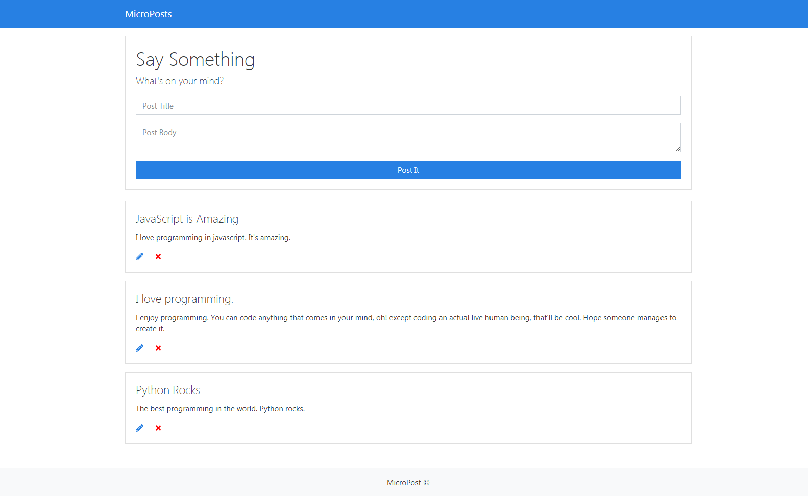

# MICROPOST 
Single page website made with html, css, and javascript. 
The site allows the user to post anything and it'll be shown on the page. 
The user can edit or delete post on the page. The program uses a fake  
json REST api on the backend to store posts.

## Installation
- Clone this repo. `git clone <repo-url>`
- Run `npm install`
- Run `npm run json:server`
- Run `npm start`

## Author

* **Afriyie Daniel**

Hope You Enjoy Using It !!!!